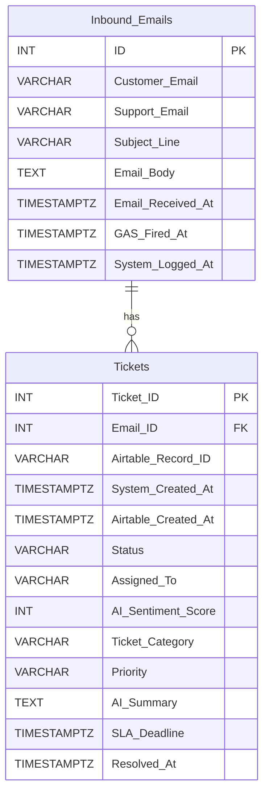

# AutoTriage: Intelligent Customer Success Pipeline

## Overview
AutoTriage is an end-to-end automated workflow designed to handle incoming customer inquiries. It acts as a digital mailroom that ingests emails, uses an AI Agent to categorize and assess urgency, routes the tasks to a project management workspace, and stores the data for long-term statistical analysis.

## The Business Problem
Manual triage of customer support emails leads to delayed response times and lost data. This project solves that by automating the ingestion, decision-making, and routing processes, leaving human workers to handle only the final resolution.

## Tech Stack & Architecture
* **Data Ingestion:** Google Apps Script (GAS)
* **Orchestration & Backend:** Python (FastAPI)
* **AI Processing:** [LLM - Gemini API]
* **Workflow Management:** Airtable (REST API, Automations, Formulas)
* **Persistent Storage:** SQL (PostgreSQL)
* **Advanced Analytics:** R (Data Wrangling & Automated Reporting)

## System Flow
1. **Listen:** GAS monitors a specific inbox for incoming emails and extracts the payload.
2. **Analyze:** Python receives the payload and passes it to an AI agent to extract sentiment, category, and urgency.
3. **Route:** Python makes a REST API call to Airtable to create an actionable ticket. Native Airtable automations alert the team based on urgency.
4. **Archive:** Python simultaneously logs the raw payload and AI insights into a relational SQL database.
5. **Analyze:** An R script periodically queries the SQL database to generate statistical trend reports.

### Database Schema



## API Contracts

This project relies on two primary REST API connections to move data from the ingestion point to the workflow management board.

### 1. Ingestion: Google Apps Script -> Python Server
This endpoint receives raw email payloads extracted from Gmail and inserts them into the `Inbound_Emails` SQL table.

* **Method:** `POST`
* **Endpoint:** `/api/v1/tickets/inbound`
* **Headers:**
  * `Content-Type: application/json`
  * `x-api-key: <YOUR_SECRET_PYTHON_API_KEY>`
* **Request Body:**
  ```json
  {
      "Customer_Email": "abc@gmail.com",
      "Support_Email": "support-xyz@gmail.com",
      "Subject_Line": "Need help with receipt generation",
      "Email_Body": "Did not receive an e-receipt after I made a payment of INR 2499 for the JKL product.",
      "Email_Received_At": "2026-04-25T12:19:00.000Z",
      "GAS_Fired_At": "2026-04-25T12:29:05.000Z"
  }
  ```
* **Expected Response (Success):** `201 Created`
  ```json
  {
      "status": "success",
      "message": "Email ingested and queued for AI processing.",
      "internal_email_id": 42
  }
  ```
* **Expected Response (Error):** `422 Unprocessable Entity` (If JSON is formatted incorrectly) or `401 Unauthorized` (If API key is missing)

### 2. Routing: Python Server -> Airtable
After the Python server enriches the raw email with AI metadata, it pushes the actionable data to the Airtable workspace.

* **Method:** `POST`
* **Endpoint:** `https://api.airtable.com/v0/{baseId}/{tableId}`
* **Headers:**
  * `Content-Type: application/json`
  * `Authorization: Bearer <YOUR_AIRTABLE_PERSONAL_ACCESS_TOKEN>`
* **Request Body:**
  ```json
  {
      "records": [
        {
          "fields": {
            "Customer_Email": "abc@gmail.com",
            "Subject_Line": "Need help with receipt generation",
            "AI_Summary": "The customer is requesting a missing e-receipt for a 2499 INR purchase of the JKL product.",
            "Ticket_Category": "Billing",
            "Priority": "Medium",
            "AI_Sentiment_Score": 4,
            "Status": "Open",
            "SLA_Deadline": "2026-04-26T12:19:00.000Z"
          }
        }
      ]
  }
  ```
* **Expected Response (Success):** `200 OK` Note: Python extracts the `id` and `createdTime` from this response to save into the SQL `Tickets` table.
  ```json
  {
      "records": [
        {
          "id": "recL1a2B3c4D5e6F7",
          "createdTime": "2026-04-25T12:30:26.000Z",
          "fields": {
            "Customer_Email": "abc@gmail.com",
            "Subject_Line": "Need help with receipt generation"
          }
        }
      ]
  }
  ```
## Phases of development
* System Architecture & Database Schema Design
* Phase 1: Data Ingestion (GAS to Python)
* Phase 2: AI Orchestration
* Phase 3: Airtable Routing
* Phase 4: SQL Archiving
* Phase 5: R Analytics
